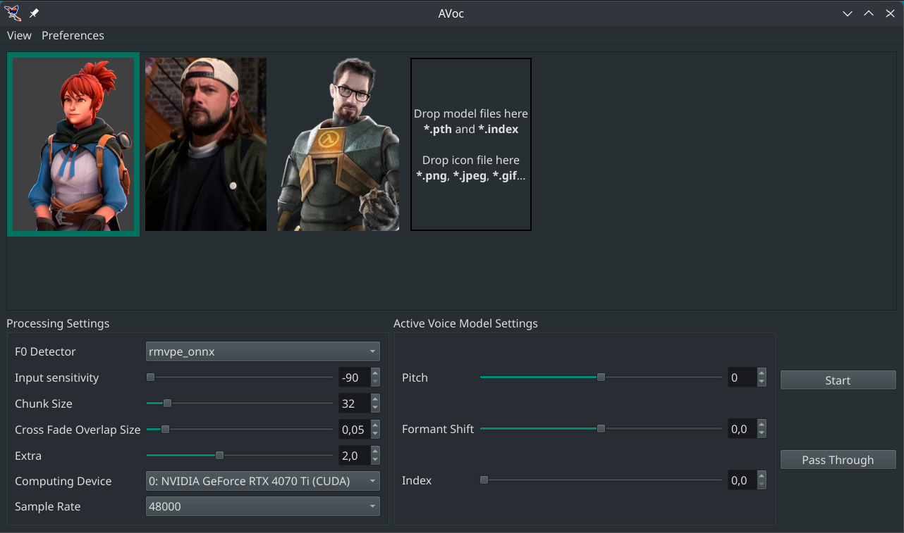

# AVoc: Local Realtime Voice Changer for Desktop

A speech-to-speech converter that uses AI models locally to convert microphone audio to a different voice in near-realtime.

Suitable for gaming and streaming.

# Quick Start

Drag your voice model files into the window.



# Features

- [X] Import of the voice models provided by the user
- [X] Switching between voices
- [X] Pitch adjustments
- [X] Hotkeys and popup notifications for the ease of use in the background
- [X] Pass Through

# Platforms

- **Linux + NVIDIA GPU + compatible driver**: primary supported runtime platform (`install.sh`).
- **Windows + NVIDIA GPU + compatible driver**: supported when validated by the current pinned dependency set (`install.ps1`).
- **macOS**: unsupported for AVoc CUDA builds.
- **CPU-only packaged mode**: unsupported.

# Goal

Make voice changing more developer-friendly by creating
  - a voice conversion library
  - a simple voice changer desktop application
  - a command-line voice changer program

Open Source and Free for modification.

# Installation

> **Portable install (recommended):**  
> Linux: `./install.sh --prefix "$HOME/.local/opt/avoc" --no-shortcuts`  
> Windows (PowerShell): `.\install.ps1 -Prefix "$env:LOCALAPPDATA\AVoc" -NoShortcuts`

## Canonical install layout

AVoc now supports a single install root (`AVOC_HOME`) with this layout:

```text
<root>/bin     launchers (for example, bin/avoc and optional bin/avoc.fish)
<root>/.venv   Python virtual environment
<root>/app     package/runtime files
<root>/data    models, pretrain, voice cards, settings, cache, logs
```

The `bin/avoc` launcher (and `bin/avoc.fish`) sets:

- `AVOC_HOME=<root>`
- `AVOC_DATA_DIR=<root>/data`

and redirects runtime write locations (`QSettings`, model storage, cache/state homes) into `<root>/data`.

## Portable installer (Linux and Windows)

### Prerequisites

- NVIDIA driver is required.
- CUDA availability is required at runtime (doctor validates GPU/ONNX readiness unless skipped).
- Python runtime is installer-managed by default (`installer-managed-python` mode); use `--use-system-python` (Linux) or `-UseSystemPython` (PowerShell) only when intentionally opting out.

Requires Python 3.12 (or compatible), `venv`, and build tools needed by the pinned dependencies.

After prerequisites are in place, install AVoc into any target folder with one command:

```sh
git clone https://github.com/AkeroGit/AvocCompleteTest
cd AvocCompleteTest/avoc-master
./install.sh --prefix "$HOME/.local/opt/avoc" --no-shortcuts
```

Run directly:

```sh
$HOME/.local/opt/avoc/bin/avoc
```

Optional fish-native launcher:

```fish
$HOME/.local/opt/avoc/bin/avoc.fish
```

Optional PATH setup for fish:

```fish
set -Ux fish_user_paths $HOME/.local/opt/avoc/bin $fish_user_paths
```

For Windows PowerShell:

```powershell
.\install.ps1 -Prefix "$env:LOCALAPPDATA\AVoc" -NoShortcuts
```

Both installers run preflight checks (Python 3.12.x, `venv`, and package-index connectivity) before creating the virtual environment. On Windows, `install.ps1` resolves Python in this order: `py -3.12`, then `python`, and prints the resolved interpreter path/version before environment creation. If you're intentionally offline with local package sources, use `--skip-connectivity-check` (Linux) or `-SkipConnectivityCheck` (PowerShell).

**Install success criteria:** a successful install requires post-install doctor validation to pass. Only bypass this intentionally with `--skip-doctor` (Linux) or `-SkipDoctor` (PowerShell).

### Managed runtime source overrides (enterprise / air-gapped)

The installer-managed runtime is pinned to **Python 3.12.3** for deterministic installs.

You can override where the runtime artifact comes from (internal mirror, local file share, removable media) and pin its checksum:

- Linux: `--python-runtime-url` and `--python-runtime-sha256`
- Windows PowerShell: `-PythonRuntimeUrl` and `-PythonRuntimeSha256`

Examples:

```sh
./install.sh \
  --prefix "$HOME/.local/opt/avoc" \
  --python-runtime-url "https://artifacts.example.com/avoc/python/cpython-3.12.3-linux-x86_64.tar.gz" \
  --python-runtime-sha256 "<sha256>" \
  --no-shortcuts
```

```sh
./install.sh \
  --prefix "$HOME/.local/opt/avoc" \
  --python-runtime-url "/mnt/media/cpython-3.12.3-linux-x86_64.tar.gz" \
  --python-runtime-sha256 "<sha256>" \
  --no-shortcuts
```

```powershell
.\install.ps1 `
  -Prefix "$env:LOCALAPPDATA\AVoc" `
  -PythonRuntimeUrl "https://artifacts.example.com/avoc/python/python.3.12.3.nupkg" `
  -PythonRuntimeSha256 "<sha256>" `
  -NoShortcuts
```

When downloading over HTTP(S), installers use retry with exponential backoff and emit explicit remediation guidance if all attempts fail. Checksum mismatches hard-fail and require replacing the artifact with a trusted Python 3.12.3 build before re-running install.

### Troubleshooting (Windows installer interpreter selection)

- `install.ps1` aborts if the resolved interpreter is not Python 3.12.x.
- If the wrong interpreter is selected, prefer running with the Python Launcher installed (`py`) and ensure `py -3.12` works from PowerShell.
- If `py` is unavailable, update your `PATH` so `python` points to a Python 3.12.x install.

## Uninstall modes

### 1) Portable delete-only

If you installed with `--no-shortcuts` / `-NoShortcuts`, AVoc is fully portable.
Remove it by deleting the install root directory (`<root>`).

### 2) Integrated uninstall command

For installs that may have external shortcut artifacts, run the generated helper:

- Linux shell: `<root>/bin/uninstall`
- Windows cmd: `<root>\bin\uninstall.cmd`
- Windows PowerShell: `<root>\bin\uninstall.ps1`

The helper prompts for confirmation, removes all paths listed in
`<root>/install-manifest.txt` (safe if already missing), and then deletes
`<root>` in one command.

To skip the prompt in automation:

```sh
<root>/bin/uninstall --yes
```

```powershell
<root>\bin\uninstall.ps1 -Yes
```

## (Optional) Virtual Microphone

The voice changer will latch to the actual default microphone, so a virtual microphone isn't needed.

But there are cases when you would want to configure your operating system to provide a virtual microphone:

- When you absolutely don't want to be heard without the voice changer when something crashes and reverts to the direct microphone input.
- When you want to use the AVoc's QtMultimedia backend instead of its PipeWire backend (by uninstalling the pipewire-filtertools package from the Python environment).
- When you're not on the Linux operating system.

## (Optional) EasyEffects

It's fine to use with EasyEffects: put "Noise Reduction" and "Autogain" as the input effects there.

# Development

## Python Environment

Assign a compatible Python version to this directory using pyenv:

```sh
pyenv local 3.12.3
```

Create an environment using venv:

```sh
python -m venv .venv
```

or through VSCode with `~/.pyenv/shims/python` as the Python interpreter.

Install the dependencies:

```sh
source .venv/bin/activate
pip install -r requirements-3.12.3.txt
```

Run:

```sh
./bin/avoc
```

(Optional) Get sources of the voice conversion library and install it in developer mode:

```sh
(cd .. && git clone <voiceconversion-repository-url>)
source .venv/bin/activate
pip uninstall voiceconversion
pip install -e ../voiceconversion --config-settings editable_mode=strict
```

It allows to work on the voice conversion library.

(Optional) Add to the "configurations" in the VSCode's launch.json:

```json
{
    "name": "Python Debugger: Module",
    "type": "debugpy",
    "request": "launch",
    "module": "main",
}
```

## Maintainer note: repository metadata

Repository branding/URLs are centralized in `repo-config.env`.

When this repo is renamed or moved:
1. Edit `repo-config.env`.
2. Run `python scripts/sync_repo_metadata.py` to refresh README and package URLs.
3. Keep `voiceconversion-master/pyproject.toml` URLs upstream unless you intentionally fork/publish that package identity.
4. Commit the updated generated files.
5. Run `./scripts/check_metadata_consistency.sh` before opening a PR.
